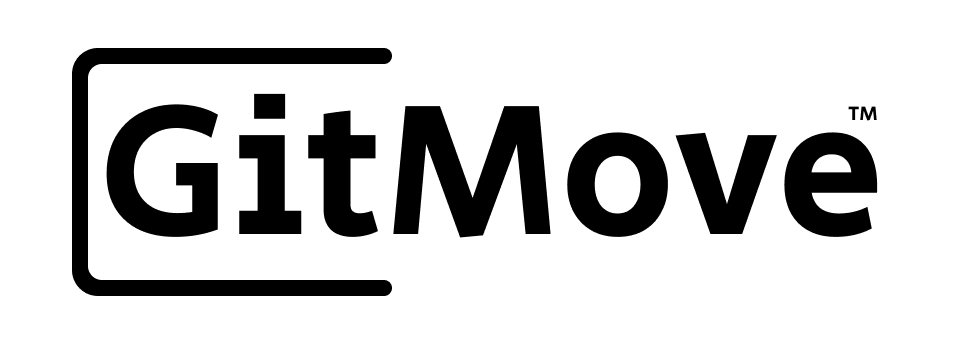

  

  Git out of harm’s way™

  
🛡️ Protect your <code>.git</code>

  
🚚 Use your <code>.git</code> anywhere

  
📦 Move your <code>.git</code> easily — even offline

  <em>Coming Summer 2025.</em>

---

### ⚖️ Licensing & Future Plans

GitMove is currently under active development and will be released under the [MIT License](./LICENSE.md).  
This public GitMove CLI will remain 100% open source and fully accessible to developers.  
A future **GitMove Pro** edition may offer premium features for advanced users and teams.

---

### 📬 Early Access Interest List

GitMove is currently inviting early interest from developers, solo users, and OSS supporters.

You can submit your name and email at [GitMove.com](https://gitmove.com) to receive occasional project updates when major milestones are hit.

- No automated emails or bulk newsletters  
- Just personal updates from the creator  
- Hosted securely via [Formspree.io](https://formspree.io)  
- You’ll never be spammed or added to any third-party lists

---

### 👤 Created and Maintained By

**Mike Hans**  
Contact: [marthurhans@gitmove.com](mailto:marthurhans@gitmove.com)

---

> “GitMove”, “GitMove CLI”, “GitMove Pro”, "Git out of harm’s way™", and the GitMove logos are trademarks of Mike Hans.  
> All rights reserved. Unauthorized use of the brand, logo, or affiliated repositories is prohibited.  
> See [LICENSE.md](./LICENSE.md) for terms and trademark scope.

